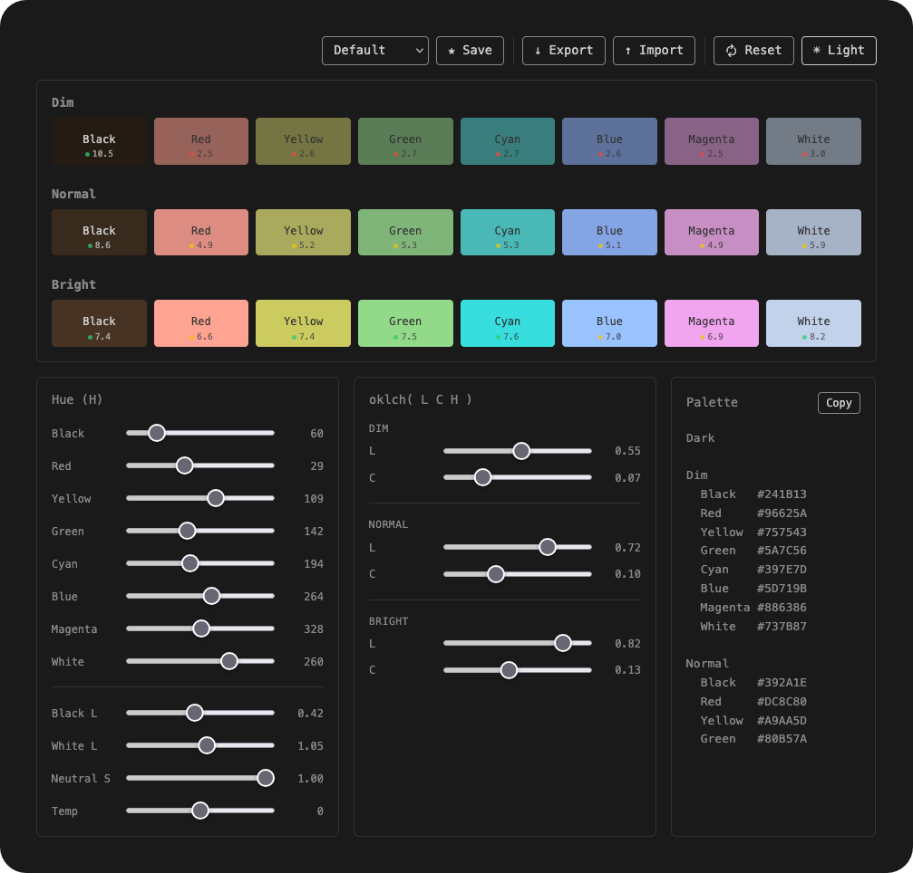

# ANSI Palette Generator

A self-contained, single-file HTML tool for designing 16-color ANSI terminal palettes in pastel style.

## Usage

Open `ansi-palette-generator.html` directly in a browser — no server, no install, no build.

## Features

- 24 swatches: 3 rows (Dim / Normal / Bright) × 8 colors
- Colors generated algorithmically from OKLCH parameters
- Per-group lightness and chroma sliders
- Per-color hue sliders
- Temperature offset for warm/cool global tinting
- Dark/Light mode with independent L/C parameters
- Built-in presets (Default, Warm, Cool, Nord-ish, Muted, Vivid, Kizuna AI, Pinkzuna)
- Save/load custom presets via localStorage
- Export/import palette state as JSON
- WCAG contrast badges on each swatch
- Copy palette as Zed theme keys (`terminal.ansi.*`)

## Browser Requirements

Chrome 111+, Firefox 113+, or Safari 15.4+ (OKLCH CSS support required).

## License

[MIT](LICENSE)
